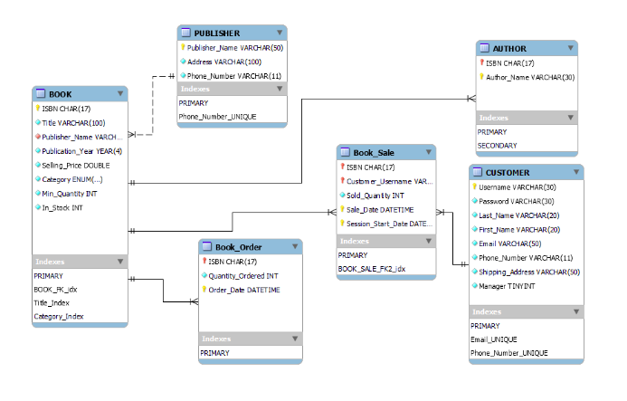

## Table of contents
* [Description](#general-info)
* [Technologies](#technologies)
* [Analysis](#analysis)

## Description
A management system with two modes one for user to search for books in system and buy them, other mode for
the manager to order books from publisher when a shortage in books occurs and this shortage is detected by system using triggers in database.

## Technologies
* java JDBC
* javafx for GUI
* MYSQL database

#Analysis
check 
<a href="https://docs.google.com/document/d/1EOEwltV-NHVO6g2dYn0r0wqH2fxYhbNm4ZLPrAyawtI/edit?usp=sharing" target="_blank">Report</a>

###ERD Diagram

